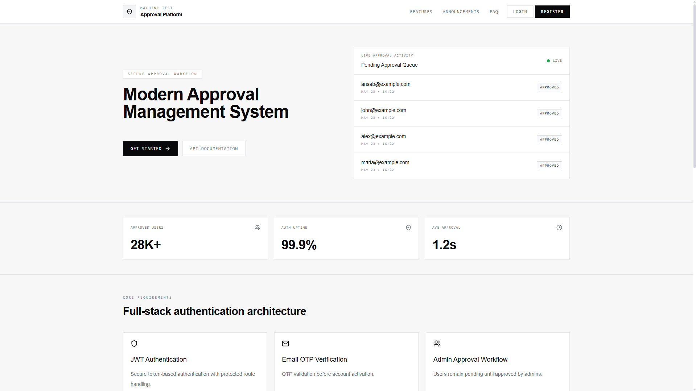
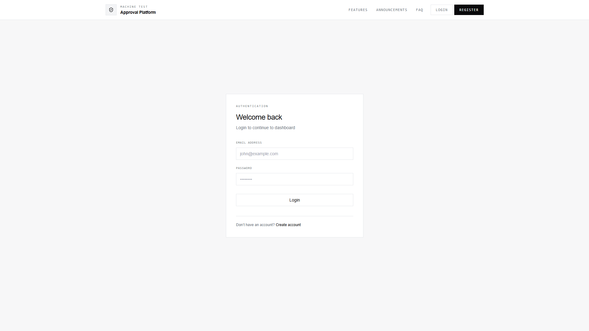
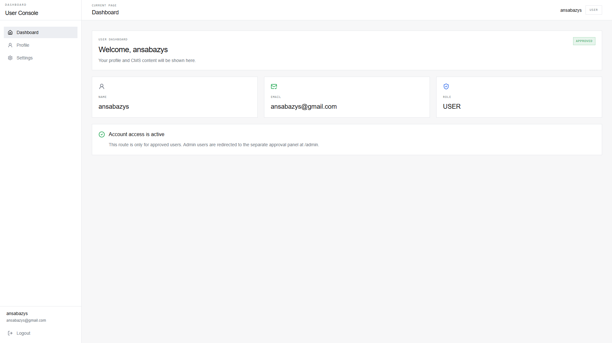
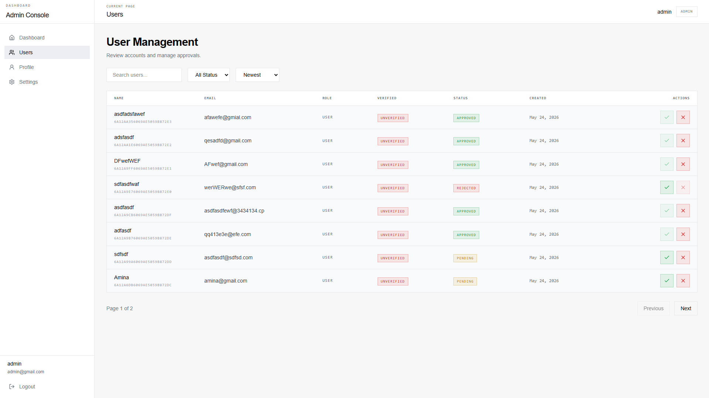
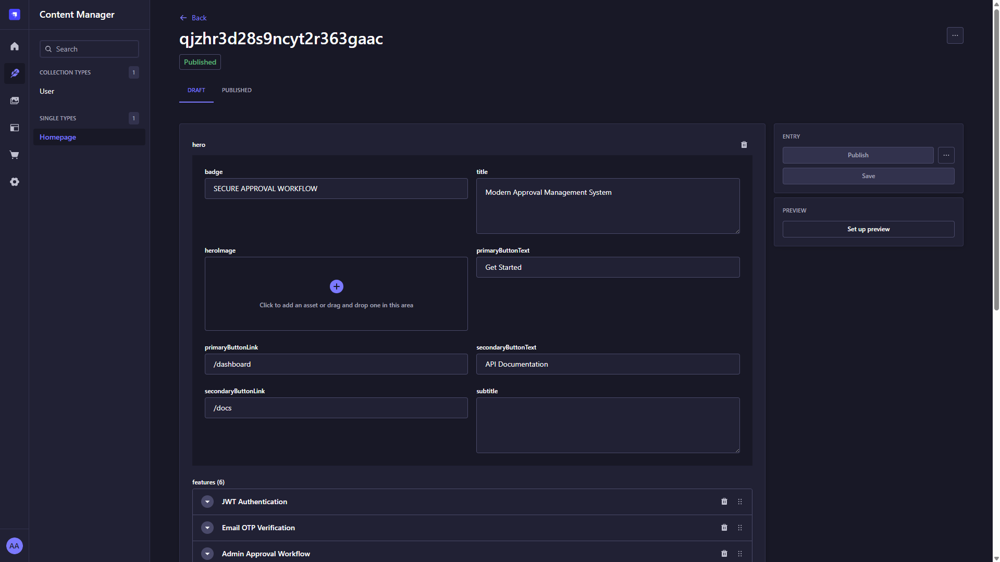

# 🚀 Fullstack Machine Test Application

A production-grade fullstack application built with modern technologies featuring authentication, admin approval workflow, CMS integration, protected routes, responsive dashboards, and API documentation.

---

# 🌐 Live Demo

## Frontend

https://machine-test-client.vercel.app

---

## Backend API

https://machine-test-k1s4.onrender.com

---

## Swagger Documentation

https://machine-test-k1s4.onrender.com/api-docs

---

## Strapi CMS

https://machine-test-cms.onrender.com/admin

---

# 📸 Screenshots

## Homepage

<!-- Add Screenshot -->


---

## Login Page

<!-- Add Screenshot -->


---

## User Dashboard

<!-- Add Screenshot -->


---

## Admin Dashboard

<!-- Add Screenshot -->


---


## CMS Dashboard

<!-- Add Screenshot -->


---

# ✨ Features

## 🔐 Authentication System

- User Registration
- OTP Email Verification
- Secure Login
- JWT Authentication
- Protected Routes
- Logout Functionality

---

## 👨‍💼 Admin Workflow

- Admin Approval System
- User Management Dashboard
- Approve / Reject Users
- Search & Filtering
- Pagination
- Responsive Admin UI

---

## 🧩 CMS Integration

- Strapi CMS Integration
- Dynamic Homepage Content
- API Driven Sections
- CMS Based Content Management

---

## 🎨 UI/UX Features

- Fully Responsive Design
- Mobile Sidebar Navigation
- Skeleton Loading States
- Empty States
- Error States
- Toast Notifications
- Confirmation Modals
- Error Boundary Handling

---

## ⚙️ Backend Features

- RESTful API
- Swagger API Documentation
- Global Error Handling
- Secure CORS Configuration
- Production Deployment Ready

---

# 🛠️ Tech Stack

## Frontend

- React
- TypeScript
- Vite
- React Router DOM
- Tailwind CSS
- Axios

---

## Backend

- Node.js
- Express.js
- TypeScript
- MongoDB Atlas
- JWT Authentication
- Swagger

---

## CMS

- Strapi CMS
- Neon PostgreSQL

---

# 🏗️ Monorepo Structure

```txt
apps
├── client    # Frontend (Vercel)
├── server    # Backend API (Render)
└── cms       # Strapi CMS (Render)

```

---

# ⚙️ Environment Variables

## Frontend

```env
VITE_API_URL=
VITE_CMS_URL=
```

---

## Backend

```env
PORT=
MONGO_URI=
JWT_SECRET=
JWT_REFRESH_SECRET=
CLIENT_URL=
EMAIL_USER=
EMAIL_PASS=
```

---

## CMS

```env
DATABASE_URL=
APP_KEYS=
API_TOKEN_SALT=
ADMIN_JWT_SECRET=
TRANSFER_TOKEN_SALT=
JWT_SECRET=
PUBLIC_URL=
```

---

# 📦 Installation

## Clone Repository

```bash
git clone <repository-url>
```

---

## Install Dependencies

```bash
pnpm install
```

---

# 🚀 Run Frontend

```bash
cd apps/client
pnpm dev
```

---

# 🚀 Run Backend

```bash
cd apps/server
pnpm dev
```

---

# 🚀 Run CMS

```bash
cd apps/cms
pnpm develop
```

---

# 🔐 Demo Credentials

## Admin

```txt
Email: admin@test.com
Password: admin123
```

---

## User

```txt
Email: user@test.com
Password: user123
```

---

# 📱 Responsive Design

The application is fully responsive and optimized for:

- Mobile Devices
- Tablets
- Desktop Screens

---

# 📚 API Documentation

Swagger documentation is available at:

```txt
/api/docs
```

---

# 🚀 Deployment

| Service   | Platform |
| ---------- | -------- |
| Frontend  | Vercel   |
| Backend   | Render   |
| CMS       | Render   |
| Database  | MongoDB Atlas + Neon |

---

# ⚠️ Notes

- Render free tier may take a few seconds to wake up inactive services.
- CMS content is managed through Strapi Admin Panel.
- Environment variables are required for production deployment.

---

# 👨‍💻 Author

Ansab
